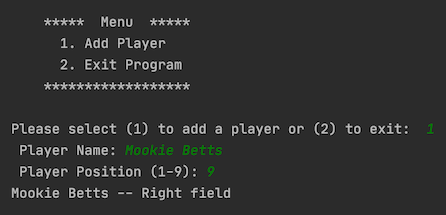
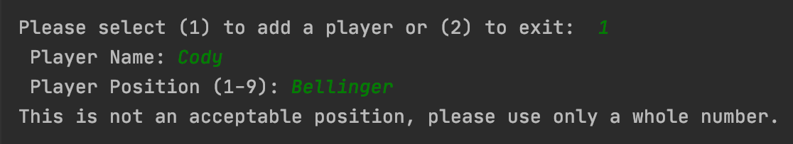
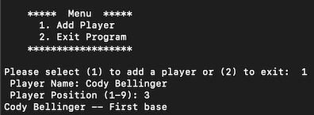
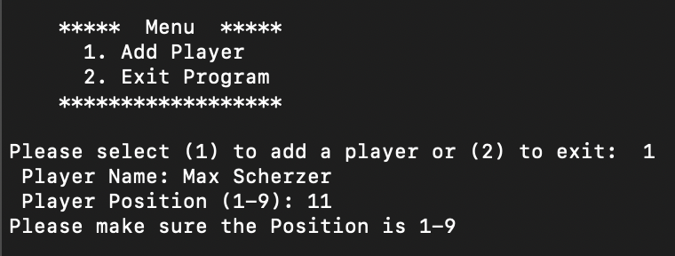
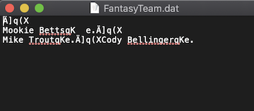

## Fantasy Baseball Wish List

### Introduction
This is a script that will allow a user to keep a wish list of players they hope to draft for a Fantasy Baseball league.  The file will be stored as a Binary file on the hard drive.  While a binary file is not the same as an encrypted file, it will not be printed in plain text, so that if someone were to open the script, they would have difficulty in reading what is contained.
This assignment is making use of the Pickle module and Try and Except blocks.

### Drafting the Script
As will the past several assignments, this script is divided according to Separation of Concerns.  The sections include Data, Processing, Presentation, and the Main Body of the Script.  First in the processing section is an Exception class.
```python
class NoPosition(Exception):
    """ Custom error for no position """
    def __str__(self):
        return "Not a playable position"
```
The positions in Baseball are numbered 1 through 9.  A range function has been created to check if the user enters a number outside of 1 up to, but not including, 10.
```python
rngPositions = range(1, 10)
```
If the user enters an integer outside of this range, the exception is raised, and an error message is returned.  There is more detail about this and Try and Except in the Main Body of the Script.
Next are two functions to create and read a binary file using Python’s Pickle module.  Pickling is one of three modules that Python uses for serialization.  This process can take a complex object structure and transform it so that it can be saved or sent over a network as a stream of bytes.  The Pickle module serializes and deserializes object in a binary format.  More about Pickling and the other serialization methods can be found on this article [The Python pickle Module: How to Persist Objects in Python (external link)](https://realpython.com/python-pickle-module/) from Real Python.
First is the function to create or add to the file.   This function is very similar to function used in early assignments with 2 differences.  First, when opening the file instead of just an ‘a’ to append, ‘ab’ is used to append binary.  Also, the dump function is what creates the file containing the serialization result.
```python
def save_roster_to_file(file_name, list_of_players):
    """ create or add to file
    :param file_name: FantasyTeam.dat
    :param list_of_players: add to the list
    """
    file = open(file_name, "ab")
    pickle.dump(list_of_players, file)
    file.close()
```
The next function will then read the data.  This is done with ‘rb’ for Read Binary and the load function.
```python
def read_roster_from_file(file_name):
    """ read the file
    :param file_name: FantasyTeam.dat
    :return: list_of_players
    """
    file = open(file_name, "rb")
    list_of_players = pickle.load(file)
    file.close()
    return list_of_players
```
Baseball positions are represented my numbers.  Pitcher is 1, Catcher is 2, and so on.   When the announcer calls a 6-4-3 Double Play, this is the Shortstop getting the ball, throwing to the Second baseman, then on to the First baseman for two outs. The next function will take the number the user enters and converts it to the player’s position for the purpose of printing to the screen to confirm to the user of their addition to the file.
```python
def position_player(lstTeam):
    """ Convert the number position into the name of the position
    this is printed in the program only to confirm to the user their choice
    :param lstTeam:
    :return: the name of the position
    """
    if intPosition == 1:
        lstTeam[1] = "Pitcher"
    elif intPosition == 2:
        lstTeam[1] = "Catcher"
    elif intPosition == 3:
        lstTeam[1] = "First base"
    elif intPosition == 4:
        lstTeam[1] = "Second base"
    elif intPosition == 5:
        lstTeam[1] = "Third base"
    elif intPosition == 6:
        lstTeam[1] = "Shortstop"
    elif intPosition == 7:
        lstTeam[1] = "Left field"
    elif intPosition == 8:
        lstTeam[1] = "Center field"
    elif intPosition == 9:
        lstTeam[1] = "Right field"
    return lstTeam
```

Finally, in the Main Body of the Script is the Try/Except function.  There are two different error that could get raised.  First if the user types in anything other than the integers from 1 through 9, such as a word or just pressing enter, the ValueError.  A ValueError is defined on [Python.org (external site)](https://docs.python.org/3/library/exceptions.html) as “Raised when an operation or function is applied to an object of inappropriate type.”  The second Error is the Exception created at the beginning of the script.  The range function will compare the number given by the user, and if it is outside of 1 through 9, this error will be raised.  This error is broader than thee ValueError message, which is why it is placed second in the script.  If either error is raised, the while loop will continue back at the original input asking the user to select either 1 or 2.  More information about Try/Except can be found in this article, [How to Best Use Try Except in Python – Especially for Beginners (external link)](https://www.techbeamers.com/use-try-except-python/).
```python
    if choice == "1":  # Add the player
        try:
            strPlayer = str(input(" Player Name: ").strip())
            intPosition = int(input(" Player Position (1-9): ").strip())
            if intPosition not in rngPositions:  # Check that choice was 1-9
                raise Exception("Not a position")
        except ValueError as e:  # if input was a string or float
            print("This is not an acceptable position, please use only a whole number.")
            continue
        except Exception as e:  # if input was not 1-9
            print("Please make sure the Position is 1-9")
            continue
```

### The Result
Whether this program is run in PyCharm or Terminal, the same text file will be accessed and updated.  The program is first run in PyCharm (figure 7.1) to create the list and add the first player.


    **Figure 7.1**
    
Next in PyCharm the player’s last name is entered in the spot where the position number should be, raising the ValueError (figure 7.2).


    **Figure 7.2**
    
The program is then run in Terminal (figure 7.2) to add another player and update the same file.


    **Figure 7.3**
    
The second error was raised in Terminal (figure 7.3) when 11 was entered instead of 1.


    **Figure 7.3**
    
The file (figure 7.4) is saved but is in binary and without a way to convert it to text is not readable by humans.  The text file does not display the binary 1s and 0s, and only the names of the players can be deciphered.


    **Figure 7.4**
    
### Conclusion
This is script that will allow a user to type in names and position numbers of baseball players they hope to draft for their fantasy baseball team.  The file is ‘dumped’ as binary into a data file which is unreadable by humans.  However, this does not mean that it is secure.  For storing sensitive information, a stronger encryption tool should be used.

### The Script
```python
# ---------------------------------------------------------------------------- #
# Title: Assignment 07
# Description: In a pickle!
#              Working with the pickle Python module
#              as well as Try and Except
#              This script will allow the user to set a wish list
#              for a Fantasy Baseball Team.
# ChangeLog:
# JPlemons, 5.28.2020, Created started script
# JPlemons, 5.29.2020, Wrote the main body
# JPlemons, 5.30.2020, Divided script into functions and separation of concerns
# ---------------------------------------------------------------------------- #

import pickle

# Data ------------------------------------------------#
# Declare the variables
strFileName = "FantasyTeam.dat"
lstTeam = []
rngPositions = range(1, 10)  # Baseball positions are identified numerically 1-9


# Processing--------------------------------------------#
class NoPosition(Exception):
    """ Custom error for no position """
    def __str__(self):
        return "Not a playable position"


def save_roster_to_file(file_name, list_of_players):
    """ create or add to file
    :param file_name: FantasyTeam.dat
    :param list_of_players: add to the list
    """
    file = open(file_name, "ab")
    pickle.dump(list_of_players, file)
    file.close()


def read_roster_from_file(file_name):
    """ read the file
    :param file_name: FantasyTeam.dat
    :return: list_of_players
    """
    file = open(file_name, "rb")
    list_of_players = pickle.load(file)
    file.close()
    return list_of_players


def position_player(lstTeam):
    """ Convert the number position into the name of the position
    this is printed in the program only to confirm to the user their choice
    :param lstTeam:
    :return: the name of the position
    """
    if intPosition == 1:
        lstTeam[1] = "Pitcher"
    elif intPosition == 2:
        lstTeam[1] = "Catcher"
    elif intPosition == 3:
        lstTeam[1] = "First base"
    elif intPosition == 4:
        lstTeam[1] = "Second base"
    elif intPosition == 5:
        lstTeam[1] = "Third base"
    elif intPosition == 6:
        lstTeam[1] = "Shortstop"
    elif intPosition == 7:
        lstTeam[1] = "Left field"
    elif intPosition == 8:
        lstTeam[1] = "Center field"
    elif intPosition == 9:
        lstTeam[1] = "Right field"
    return lstTeam


# Presentation-------------------------------------------#

def print_menu():
    print("""
    *****  Menu  *****
      1. Add Player
      2. Exit Program
    ******************""")
    print()


# Main Body of Script_____________________________________#

print("\nFantasy Baseball Pre-Draft Wish List")
print("Enter the Player and Position you hope to draft.")
while True:
    print_menu()  # Show menu items
    choice = input("Please select (1) to add a player or (2) to exit:  ")

    if choice == "1":  # Add the player
        try:
            strPlayer = str(input(" Player Name: ").strip())
            intPosition = int(input(" Player Position (1-9): ").strip())
            if intPosition not in rngPositions:  # Check that choice was 1-9
                raise Exception("Not a position")
        except ValueError as e:  # if input was a string or float
            print("This is not an acceptable position, please use only a whole number.")
            continue
        except Exception as e:  # if input was not 1-9
            print("Please make sure the Position is 1-9")
            continue

        lstTeam = [strPlayer, intPosition]

        save_roster_to_file(strFileName, lstTeam)
        read_roster_from_file(strFileName)

        position_player(lstTeam)
        print(f"{lstTeam[0].title()} -- {lstTeam[1]}")  # Print last entry to display

    elif choice == "2":  # Exit the program
        print("Good luck on the draft.")
        break

    else:
        print("There are only 2 choices.  Let's try that again.")
```
