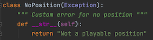
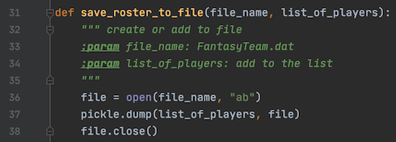

## Fantasy Baseball Wish List

### Introduction
This is a script that will allow a user to keep a wish list of players they hope to draft for a Fantasy Baseball league.  The file will be stored as a Binary file on the hard drive.  While a binary file is not the same as an encrypted file, it will not be printed in plain text, so that if someone were to open the script, they would have difficulty in reading what is contained.
This assignment is making use of the Pickle module and Try and Except blocks.

### Drafting the Script
As will the past several assignments, this script is divided according to Separation of Concerns.  The sections include Data, Processing, Presentation, and the Main Body of the Script.  First in the processing section is an Exception class (figure 7.1) 

The positions in Baseball are numbered 1 through 9.  A range function (figure 7.2) has been created to check if the user enters a number outside of 1 up to, but not including, 10.


If the user enters an integer outside of this range, the exception is raised, and an error message is returned.  There is more detail about this and Try and Except in the Main Body of the Script.
Next are two functions to create and read a binary file using Python’s Pickle module.  Pickling is one of three modules that Python uses for serialization.  This process can take a complex object structure and transform it so that it can be saved or sent over a network as a stream of bytes.  The Pickle module serializes and deserializes object in a binary format.  More about Pickling and the other serialization methods can be found on this article [The Python pickle Module: How to Persist Objects in Python (external link)](https://realpython.com/python-pickle-module/) from Real Python.
First is the function to create or add to the file (figure 7.3).   This function is very similar to function used in early assignments with 2 differences.  First, when opening the file (line 36) instead of just an ‘a’ to append, ‘ab’ is used to append binary.  Also, the dump function (line 37) is what creates the file containing the serialization result.


The next function (figure 7.4) will then read the data.  This is done with ‘rb’ for Read Binary (line 46) and the load function (line 47).


Baseball positions are represented my numbers.  Pitcher is 1, Catcher is 2, and so on.   When the announcer calls a 6-4-3 Double Play, this is the Shortstop getting the ball, throwing to the Second baseman, then on to the First baseman for two outs. The next function (figure 7.5) will take the number the user enters and converts it to the player’s position for the purpose of printing to the screen to confirm to the user of their addition to the file.


Finally, in the Main Body of the Script is the Try/Except function (figure 7.6).  There are two different error that could get raised.  First if the user types in anything other than the integers from 1 through 9, such as a word or just pressing enter, the ValueError.  A ValueError is defined on Python.org (external site) as “Raised when an operation or function is applied to an object of inappropriate type.”  The second Error is the Exception created at the beginning of the script.  The range function will compare the number given by the user, and if it is outside of 1 through 9, this error will be raised.  This error is broader than thee ValueError message, which is why it is placed second in the script.  If either error is raised, the while loop will continue back at the original input asking the user to select either 1 or 2.  More information about Try/Except can be found in this article, [How to Best Use Try Except in Python – Especially for Beginners (external link)](https://www.techbeamers.com/use-try-except-python/).


###The Result
Whether this program is run in PyCharm or Terminal, the same text file will be accessed and updated.  The program is first run in PyCharm (figure 7.7) to create the list and add the first player.


Next in PyCharm the player’s last name is entered in the spot where the position number should be, raising the ValueError (figure 7.8).


The program is then run in Terminal (figure 7.9) to add another player and update the same file.


The second error was raised in Terminal when 11 was entered instead of 1 (figure 7.10).


The file (figure 7.11) is saved but is in binary and without a way to convert it to text is not readable by humans.  The text file does not display the binary 1s and 0s, and only the names of the players can be deciphered.


###Conclusion
This is script that will allow a user to type in names and position numbers of baseball players they hope to draft for their fantasy baseball team.  The file is ‘dumped’ as binary into a data file which is unreadable by humans.  However, this does not mean that it is secure.  For storing sensitive information, a stronger encryption tool should be used.


You can use the [editor on GitHub](https://github.com/jaytreelove/IntroToProg-Python-Mod07/edit/master/README.md) to maintain and preview the content for your website in Markdown files.

Whenever you commit to this repository, GitHub Pages will run [Jekyll](https://jekyllrb.com/) to rebuild the pages in your site, from the content in your Markdown files.

### Markdown

Markdown is a lightweight and easy-to-use syntax for styling your writing. It includes conventions for

```markdown
Syntax highlighted code block

# Header 1
## Header 2
### Header 3

- Bulleted
- List

1. Numbered
2. List

**Bold** and _Italic_ and `Code` text

[Link](url) and 
```

For more details see [GitHub Flavored Markdown](https://guides.github.com/features/mastering-markdown/).

### Jekyll Themes

Your Pages site will use the layout and styles from the Jekyll theme you have selected in your [repository settings](https://github.com/jaytreelove/IntroToProg-Python-Mod07/settings). The name of this theme is saved in the Jekyll `_config.yml` configuration file.

### Support or Contact

Having trouble with Pages? Check out our [documentation](https://help.github.com/categories/github-pages-basics/) or [contact support](https://github.com/contact) and we’ll help you sort it out.
